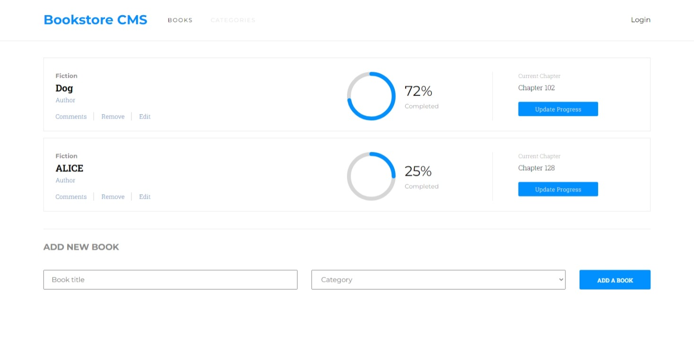

# bookstore
Book store is an app that displays a list of books, allows users to add a new book to the list as well as remove a selected book

## Screenshots

## Built With
- React
- CSS

## Prerequisites
 - [React](https://reactjs.org/docs/getting-started.html)
 -  [Git](https://git-scm.com/downloads)
 -  [Node](https://nodejs.org/en/download/)

## Installation

Go to your terminal, navigate to your working directory and run

`git clone https://github.com/RayhanTabase/bookstore.git`

After that navigate to the newly created folder

`cd bookstore`

You now have access to the files.
To install necessary dependencies run

`npm install`

Start a local server running the command

`npm start`

You should now have the project running locally on a dev server.

## Author

👤 **Salim Abdulai**

- GitHub: [@RayhanTabase](https://github.com/RayhanTabase)
- Twitter: [@RayhanTabase](https://twitter.com/@RayhanTabase)
- LinkedIn: [Salim-Abdulai](https://linkedin.com/in/salim-abdulai-5430065b)
- Email: salimabdulai2@yahoo.com

## 🤝 Contributing

Contributions, issues, and feature requests are welcome!

Feel free to check the [issues page](../../issues/).

## Show your support

Give a ⭐️ if you like this project!

## 📝 License

This project is [MIT](./MIT.md) licensed.
